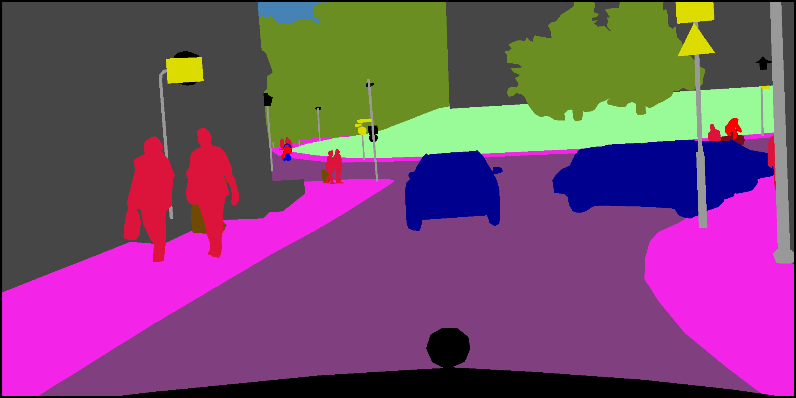

# Semantic Segmentation on PyTorch

[![python-image]][python-url]
[![pytorch-image]][pytorch-url]
[![lic-image]][lic-url]

This project aims at providing a concise, easy-to-use, modular reference implementation for semantic segmentation models using PyTorch.

<p align="center"></p>


## Update
- Add overfitting test script
- Add DUNet

## Requisites
- [PyTorch 1.0](https://pytorch.org/get-started/locally/)
- Python 3.x

## Model Zoo & Datasets

#### Supported Model

- [FCN](https://arxiv.org/abs/1411.4038)
- [PSPNet](https://arxiv.org/pdf/1612.01105)
- [DeepLabv3](https://arxiv.org/abs/1706.05587)
- [DANet](https://arxiv.org/pdf/1809.02983)
- [DenseASPP](http://openaccess.thecvf.com/content_cvpr_2018/papers/Yang_DenseASPP_for_Semantic_CVPR_2018_paper.pdf)
- [BiSeNet](https://arxiv.org/abs/1808.00897)
- [EncNet](https://arxiv.org/abs/1803.08904v1)
- [DUNet(DUpsampling)](https://arxiv.org/abs/1903.02120)

#### Supported Dataset

You can run script to download dataset, such as:

```
cd ./datasets
python ade20k.py --download-dir ./datasets/ade
```

- [VOC2012](http://host.robots.ox.ac.uk/pascal/VOC/voc2012/VOCtrainval_11-May-2012.tar)
- [VOCAug](http://www.eecs.berkeley.edu/Research/Projects/CS/vision/grouping/semantic_contours/benchmark.tgz)
- [ADK20K](http://groups.csail.mit.edu/vision/datasets/ADE20K/)
- [Cityscapes](https://www.cityscapes-dataset.com/downloads/)
- [COCO](http://cocodataset.org/#download)
- [SBU-shadow](http://www3.cs.stonybrook.edu/~cvl/content/datasets/shadow_db/SBU-shadow.zip)

## Usage
#### Train
```
python train.py --model fcn32s --backbone vgg16 --dataset pascal_voc
```
#### Evaluation
```
python eval.py --model fcn32s --backbone vgg16 --dataset pascal_voc
```
#### Run Demo
```
python demo.py --model fcn32s_vgg16_voc --input-pic ./datasets/test.jpg
```
## Result
#### PASCAL VOC 2012
|Methods|Backbone|TrainSet|EvalSet|crops_size|epochs|Mean IoU|pixAcc|
|:-:|:-:|:-:|:-:|:-:|:-:|:-:|:-:|
|FCN32s|vgg16|train|val|480|60|47.50%|85.39%|
|FCN16s|vgg16|train|val|480|60|49.16%|85.98%|
|FCN8s|vgg16|train|val|480|60|48.87%|85.02%|
|PSPNet|resnet50|train|val|480|60|63.44%|89.78%|
|DeepLabv3|resnet50|train|val|480|60|60.15%|88.36%|

Note: The parameter settings of each method are different, including crop_size, learning rata, epochs, etc. For specific parameters, please see paper.

## Overfitting Test
See [TEST](https://github.com/Tramac/Awesome-semantic-segmentation-pytorch/tree/master/tests) for details.

## To Do
- [x] Save the best model
- [x] Add EncNet loss
- [x] Add SBU downloader
- [x] Test DataParallel
- [ ] Add more semantic segmentation models (in process)
- [ ] Train and evaluate
- [ ] Add Synchronized BN ([Why SyncBN?](https://tramac.github.io/2019/04/08/SyncBN/))

## References
- [PyTorch-Encoding](https://github.com/zhanghang1989/PyTorch-Encoding)

<!--
[![python-image]][python-url]
[![pytorch-image]][pytorch-url]
[![lic-image]][lic-url]
-->

[python-image]: https://img.shields.io/pypi/pyversions/:packageName.svg?style=flat-square
[python-url]: https://www.python.org/
[pytorch-image]: https://img.shields.io/badge/PyTorch-1.0-2BAF2B.svg?style=flat-square
[pytorch-url]: https://pytorch.org/
[lic-image]: https://img.shields.io/hexpm/l/:packageName.svg?style=flat-square
[lic-url]: https://github.com/Tramac/Awesome-semantic-segmentation-pytorch/blob/master/LICENSE
