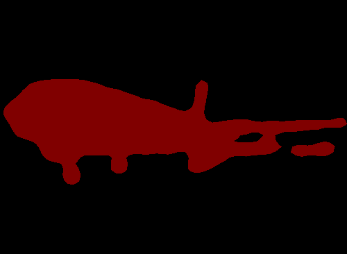
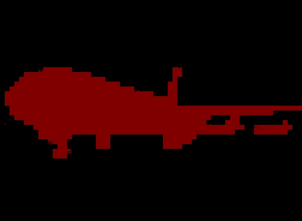
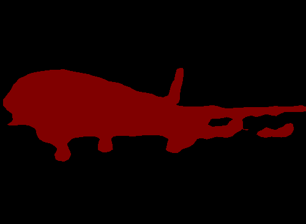
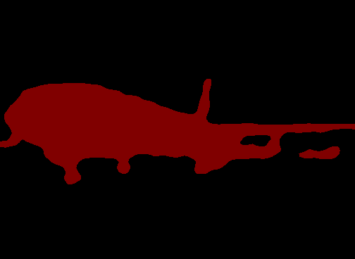

# Overfitting Test

In order to ensure the correctness of models, the project provides a overfitting test (a trick which makes the train set and the val set includes the same images) script.
Observing the convergence process of different models is so interesting:joy:

### Usage

 

　　　(a) img: 2007_000033.jpg  　　　　　　　(b) mask: 2007_000033.png

### Test Result
| Model  | backbone | epoch | mIoU  | pixAcc |
| :-----: | :----: | :-----: | :-----: | :------: |
| FCN32s | vgg16 | 200 | 94.0% | 98.2% |
| FCN16s | vgg16 | 200 | 99.2% | 99.8% |
| FCN8s | vgg16 | 100 | 99.8% | 99.9% |
| DANet | resnet50 | 100 | 99.5% | 99.9% |
| EncNet | resnet50 | 100 | 99.7% | 99.9% |
| DUNet | resnet50 | 100 | 98.8% | 99.6% |
| PSPNet | resnet50 | 100 | 99.8% | 99.9% |
| BiSeNet | resnet18 | 100 | 99.6% | 99.9% |
| DenseASPP | densenet121 | 40 | 100% | 100% |
| ICNet | resnet50 | 100 | 98.8% | 99.6% |
| ENet | scratch | 100 | 99.9% | 100% |
| OCNet | resnet50 | 100 | 99.8% | 100% |

### Visualization
 
  
  
  

　 FCN32s　　FCN16s　　 FCN8s　　 DANet　　  EncNet　　 　DUNet　　 PSPNet　　 BiSeNet　　 DenseASPP

 

　 ICNet　　　ENet　　 OCNet

### Conclusion
- The result of FCN32s is the worst.
- There are gridding artifacts in DUNet results.
- The result of BiSeNet is bad when the `lr=1e-3`, the lr needs to be set to `1e-2`.
- DenseASPP has the fastest convergence process, and reached 100%.
- The lr of ENet need to be set to `1e-2`, the edge of result is not smooth.